# 🔄 Data Processing Architecture

**Agents OS Synchronized Data Flow & Processing System**

## 🎯 Overview

Agents OS implements a beautifully synchronized architecture where users, agents, and data seamlessly flow together to create intelligent, stateful AI assistants. This document outlines the complete data processing pipeline and synchronization mechanisms.

---

## 🏗️ Core Architecture Principles

### 1. **Perfect Data Isolation** 🔐
- Every piece of data belongs to exactly one user
- Row Level Security (RLS) automatically enforces boundaries
- Zero cross-user data leakage possible

### 2. **Automatic Synchronization** ⚡
- File uploads instantly become agent knowledge
- Agent learning persists across sessions
- Knowledge base updates enhance all user agents

### 3. **Intelligent Context Injection** 🧠
- Agents automatically access relevant user knowledge
- Semantic search finds contextually appropriate content
- File content injected into agent conversations

---

## 🔄 Data Flow Diagrams

### Complete System Architecture


### File Processing Pipeline

```mermaid
graph LR
    A[📁 File Upload] --> B[🔧 FileProcessor]
    B --> C[☁️ Storage Upload]
    B --> D[📝 Text Extraction]
    B --> E[🧠 Generate Embeddings]
    
    C --> F[🗂️ Smart Bucket Selection]
    F --> F1[agent-assets]
    F --> F2[user-uploads] 
    F --> F3[private-files]
    F --> F4[public-files]
    
    D --> G[📊 Content Analysis]
    G --> G1[Text Files]
    G --> G2[JSON/CSV Parsing]
    G --> G3[PDF Processing]
    G --> G4[Image OCR Ready]
    
    E --> H[🗃️ Knowledge Base Entry]
    C --> H
    G --> H
    
    H --> I[🔗 Bidirectional Linking]
    I --> J[🔍 Semantic Search Ready]
    
    style A fill:#e1f5fe
    style C fill:#f3e5f5
    style H fill:#fff3e0
    style J fill:#e8f5e8
```



---

## 🔧 Processing Components

### 1. FileProcessor Class

**Location**: `lib/knowledge-base/file-processor.ts`

**Responsibilities**:
- Upload files to appropriate Supabase Storage buckets
- Extract text content from various file formats
- Generate vector embeddings using OpenAI
- Create knowledge base entries with metadata
- Link files bidirectionally with knowledge entries

**Supported File Types**:
- **Text Files**: Direct UTF-8 content extraction
- **JSON**: Structured data parsing and representation
- **CSV**: Headers and data row extraction
- **PDF**: Ready for pdf-parse library integration
- **Images**: Ready for OCR library integration
- **Office Docs**: Ready for mammoth/docx integration

**Smart Bucket Selection**:
```typescript
// Agent-specific files
if (agentId) → 'agent-assets'

// Public sharing
if (isPublic) → 'public-files'

// Default knowledge files
default → 'user-uploads'
```

### 2. Knowledge Base Integration

**Tables Involved**:
- `KnowledgeBase` - Vector embeddings and content
- `File` - File metadata and storage info
- `Agent` - Agent ownership and access

**Synchronization Flow**:
```sql
-- File uploaded
INSERT INTO File (ownerId, name, path, metadata)

-- Content processed
INSERT INTO KnowledgeBase (
  user_id, title, content, content_type, 
  embedding, metadata
)

-- Link established
UPDATE File SET metadata = metadata || 
  '{"knowledgeBaseId": "kb-123", "linkedToKnowledge": true}'
```

### 3. Vector Search System

**Technology**: OpenAI text-embedding-ada-002
**Dimension**: 1536-dimensional vectors
**Search Method**: Cosine similarity

**Query Process**:
```typescript
// 1. Generate query embedding
const queryEmbedding = await openai.embeddings.create({
  model: 'text-embedding-ada-002',
  input: userQuery
});

// 2. Vector similarity search (RLS filtered)
const results = await supabase.rpc('similarity_search', {
  query_embedding: queryEmbedding,
  similarity_threshold: 0.7,
  match_count: 5
});

// 3. Inject into agent context
const context = formatKnowledgeContext(results);
```

---

## 🔐 Security & Isolation

### Row Level Security Policies

**Users Table**:
```sql
CREATE POLICY "Users can only access own data" 
  ON users FOR ALL USING (auth.uid() = id);
```

**Agents Table**:
```sql
CREATE POLICY "Users can only access own agents" 
  ON agents FOR ALL USING (auth.uid() = user_id);
```

**Knowledge Base Table**:
```sql
CREATE POLICY "Users can only access own knowledge" 
  ON knowledge_base FOR ALL USING (auth.uid() = user_id);
```

**File Storage**:
```sql
CREATE POLICY "Users can only access own files" 
  ON file FOR ALL USING (auth.uid() = ownerId);
```

### Data Isolation Guarantees

1. **Database Level**: RLS enforced at PostgreSQL level
2. **Storage Level**: Supabase Storage with bucket policies
3. **Application Level**: User ID validation in all queries
4. **Cache Level**: Redis keys prefixed with user ID

---

## ⚡ Performance Optimizations

### 1. Redis Caching Strategy

**Query Results Cache**:
```typescript
// Cache vector search results (5-minute TTL)
const cacheKey = `knowledge:${userId}:${queryHash}`;
await redis.setex(cacheKey, 300, JSON.stringify(results));
```

**Agent Context Cache**:
```typescript
// Cache agent memory and context (1-hour TTL)
const cacheKey = `agent:${agentId}:context`;
await redis.setex(cacheKey, 3600, JSON.stringify(context));
```

### 2. Database Indexing

**Vector Search Index**:
```sql
-- Vector similarity index (requires pgvector)
CREATE INDEX knowledge_base_embedding_idx 
  ON knowledge_base USING ivfflat (embedding vector_cosine_ops);
```

**Query Performance Indexes**:
```sql
-- User-scoped queries
CREATE INDEX idx_knowledge_base_user_id ON knowledge_base(user_id);
CREATE INDEX idx_agents_user_id ON agents(user_id);
CREATE INDEX idx_file_owner_id ON file(ownerId);

-- Content type filtering
CREATE INDEX idx_knowledge_base_content_type ON knowledge_base(content_type);
```

### 3. Async Processing

**Background Jobs**:
- Embedding generation for large files
- Batch text extraction
- Periodic cache warming
- Analytics aggregation

---

## 🔄 Real-Time Synchronization

### 1. Agent Memory Updates

**When agents learn something new**:
```typescript
// 1. Store in agent memory
await supabase.from('AgentMemory').insert({
  agent_id: agentId,
  key: 'learned_fact',
  value: newKnowledge,
  embedding: await generateEmbedding(newKnowledge)
});

// 2. Invalidate cache
await redis.del(`agent:${agentId}:context`);

// 3. Trigger real-time update
await supabase.channel('agent_updates')
  .send({ type: 'memory_updated', agentId });
```

### 2. Knowledge Base Updates

**When users upload files**:
```typescript
// 1. Process file immediately
const result = await FileProcessor.processFileForKnowledgeBase(...);

// 2. Update agent contexts
await redis.del(`knowledge:${userId}:*`);

// 3. Notify connected agents
await supabase.channel('knowledge_updates')
  .send({ type: 'knowledge_added', userId, knowledgeId });
```

---

## 📊 Monitoring & Analytics

### 1. Processing Metrics

**File Processing Success Rate**:
- Files uploaded vs. successfully processed
- Processing time by file type
- Error rates and failure reasons

**Knowledge Base Quality**:
- Embedding generation success rate
- Vector search performance
- Context relevance scoring

### 2. Agent Performance

**Knowledge Utilization**:
- How often agents access knowledge base
- Which knowledge is most frequently accessed
- Context injection effectiveness

**Memory Growth**:
- Agent memory accumulation over time
- Learning rate by agent type
- Memory retrieval patterns

---

## 🚀 Future Enhancements

### 1. Advanced File Processing

**Planned Integrations**:
- **PDF Processing**: pdf-parse for full text extraction
- **OCR Integration**: Tesseract.js for image text extraction
- **Office Documents**: mammoth for Word docs, XLSX parsing
- **Audio/Video**: Whisper integration for transcription

### 2. Enhanced AI Features

**Smart Content Analysis**:
- Automatic content categorization
- Duplicate detection and merging
- Content quality scoring
- Relationship mapping between documents

### 3. Performance Improvements

**Advanced Caching**:
- Hierarchical cache warming
- Predictive content loading
- Distributed cache synchronization
- Edge cache integration

---

## 🔗 API Endpoints

### Knowledge Base Files API

**Upload and Process**: `POST /api/knowledge-base/files`
```typescript
// Request
FormData {
  file: File,
  title: string,
  category: string,
  agentId?: string,
  isPublic?: boolean
}

// Response
{
  success: true,
  knowledgeBaseId: "kb-123",
  fileId: "file-456",
  hasEmbedding: true,
  extractedContentLength: 1542
}
```

**List Files**: `GET /api/knowledge-base/files`
```typescript
// Query params: ?limit=20&offset=0&agentId=agent-123

// Response
{
  files: KnowledgeFile[],
  pagination: {
    total: 45,
    limit: 20,
    offset: 0,
    hasMore: true
  }
}
```

**Remove from Knowledge Base**: `DELETE /api/knowledge-base/files?fileId=file-123`
```typescript
// Response
{
  success: true,
  message: "File removed from knowledge base (file preserved in storage)"
}
```

---

This architecture creates **true AI assistant intelligence** - agents that remember, learn, and grow with their users while maintaining perfect security and performance at scale. 