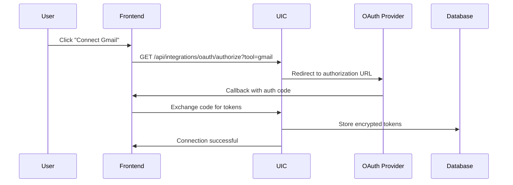
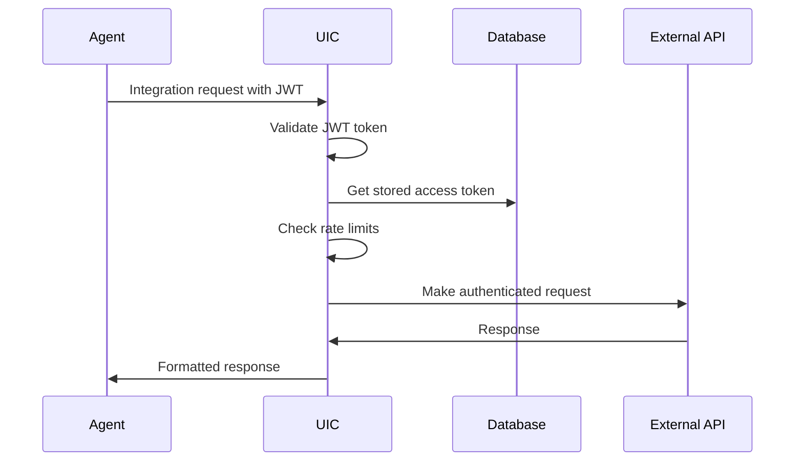

# Universal Integrations Core (UIC) 🔗

The **Universal Integrations Core** is a centralized, modular service that powers **all third-party tool connections** in Overseer Agent OS. It's the "one ring to rule them all" for integrations.

## 🏗️ Architecture Overview

```
[Frontend Agents] 
      ↓
[/api/integrations Gateway]
      ↓  
[Universal Integrations Core] → [Tool Adapters]
      ↓                            ↓
[OAuth Manager] ← → [Gmail] [Slack] [Notion] [Asana] ...
      ↓
[Supabase + Redis]
```

## ⚙️ Core Components

### 1. Universal Integrations Core (`lib/integrations/universal-integrations-core.ts`)
- **Central Router**: Routes API calls to appropriate adapters
- **Authentication Manager**: Validates JWT tokens and tool connections
- **Rate Limiting**: Redis-based sliding window rate limits
- **Response Caching**: Intelligent caching with TTL
- **Error Handling**: Comprehensive error parsing and retry logic

### 2. OAuth Manager (`lib/integrations/oauth-manager.ts`)
- **OAuth 2.0 Flows**: Complete authorization code flow
- **Token Management**: Automatic refresh and storage
- **Platform Support**: Gmail, Slack, Notion out of the box
- **Connection Testing**: API validation for each platform

### 3. Tool Adapters (`lib/plugin-engine/adapters/`)
- **Gmail Adapter**: Email sending, fetching, and management
- **Slack Adapter**: Message posting, channel management, file uploads
- **Notion Adapter**: Page creation, database queries, content management
- **Base Adapter**: Common functionality for all adapters

## 🚀 API Endpoints

### Main Integration Gateway
```
POST /api/integrations
GET /api/integrations
DELETE /api/integrations
```

### OAuth Authorization
```
GET /api/integrations/oauth/authorize?tool=gmail
```

### Tools Discovery
```
GET /api/integrations/tools
```

### Enhanced Agent Chat
```
POST /api/agents/[agentId]/chat-with-integrations
```

## 💻 Usage Examples

### Frontend Hook Usage
```typescript
import { useIntegrations } from '@/lib/hooks/use-integrations';

function IntegrationsPage() {
  const { 
    tools, 
    statuses, 
    executeIntegration, 
    connectTool, 
    isToolConnected 
  } = useIntegrations();

  // Connect to Gmail
  const handleConnectGmail = async () => {
    const authUrl = await connectTool('gmail');
    if (authUrl) {
      window.location.href = authUrl;
    }
  };

  // Send an email via agent
  const handleSendEmail = async () => {
    const result = await executeIntegration('gmail', 'send', {
      to: 'user@example.com',
      subject: 'Hello from Agent',
      body: 'This email was sent by my AI agent!'
    });
    
    console.log('Email sent:', result.success);
  };

  return (
    <div>
      {tools.map(tool => (
        <div key={tool.id}>
          <h3>{tool.name}</h3>
          <p>{tool.description}</p>
          {isToolConnected(tool.id) ? (
            <span>✅ Connected</span>
          ) : (
            <button onClick={() => connectTool(tool.id)}>
              Connect
            </button>
          )}
        </div>
      ))}
    </div>
  );
}
```

### Direct API Usage
```typescript
// Execute integration action
const response = await fetch('/api/integrations', {
  method: 'POST',
  headers: {
    'Authorization': `Bearer ${accessToken}`,
    'Content-Type': 'application/json'
  },
  body: JSON.stringify({
    tool: 'slack',
    action: 'send',
    params: {
      channel: '#general',
      text: 'Hello from my agent!'
    },
    agentId: 'agent-123'
  })
});

const result = await response.json();
console.log('Slack message sent:', result.success);
```

### Agent Chat with Integrations
```typescript
// Enhanced chat that allows agents to use integrations
const response = await fetch('/api/agents/my-agent-id/chat-with-integrations', {
  method: 'POST',
  headers: {
    'Authorization': `Bearer ${accessToken}`,
    'Content-Type': 'application/json'
  },
  body: JSON.stringify({
    message: 'Send an email to john@company.com about the meeting',
    messages: [] // Previous conversation history
  })
});

const result = await response.json();
// Agent will automatically execute email integration and respond
```

## 🤖 Agent Integration Commands

Agents can use integrations during conversations with special commands:

```
[INTEGRATION: gmail send {"to": "user@example.com", "subject": "Meeting", "body": "Let's schedule a meeting"}]
[INTEGRATION: slack send {"channel": "#general", "text": "Hello team!"}]
[INTEGRATION: notion create {"title": "Meeting Notes", "content": "Notes from today's meeting"}]
```

These commands are automatically:
1. **Parsed** from agent responses
2. **Executed** via the Universal Integrations Core
3. **Replaced** with success/failure status in the response

## 🔐 Authentication Flow

### 1. OAuth Connection


### 2. API Request Authentication


## ⚡ Features

### 🔄 **Rate Limiting**
- Redis-based sliding window algorithm
- Per-user, per-tool rate limits
- Configurable limits per integration

### 📦 **Response Caching**
- 5-minute TTL for read operations
- Redis-based caching layer
- Cache invalidation on write operations

### 🛡️ **Error Handling**
- Comprehensive error parsing
- Retry logic with exponential backoff
- Standardized error responses

### 🔍 **Monitoring & Analytics**
- Execution time tracking
- Success/failure rate monitoring
- Cache hit/miss analytics

## 🛠️ Adding New Integrations

### 1. Create Adapter
```typescript
// lib/plugin-engine/adapters/asana-adapter.ts
export class AsanaAdapter implements PluginAdapter {
  async connect(userId: string): Promise<AuthStatus> {
    // Implementation
  }
  
  async send(agentId: string, payload: any): Promise<PluginResult> {
    // Implementation
  }
  
  async fetch(agentId: string, query?: any): Promise<PluginResult> {
    // Implementation
  }
  
  // ... other required methods
}
```

### 2. Register in UIC
```typescript
// lib/integrations/universal-integrations-core.ts
private initializeAdapters() {
  this.adapters.set('gmail', new GmailAdapter());
  this.adapters.set('slack', new SlackAdapter());
  this.adapters.set('notion', new NotionAdapter());
  this.adapters.set('asana', new AsanaAdapter()); // Add new adapter
}
```

### 3. Add OAuth Configuration
```typescript
// lib/integrations/oauth-manager.ts
if (process.env.ASANA_CLIENT_ID && process.env.ASANA_CLIENT_SECRET) {
  this.integrations.set('asana', {
    name: 'Asana',
    icon: '📋',
    description: 'Manage tasks and projects in Asana',
    isActive: true,
    config: {
      clientId: process.env.ASANA_CLIENT_ID,
      clientSecret: process.env.ASANA_CLIENT_SECRET,
      redirectUri: `${process.env.NEXT_PUBLIC_APP_URL}/api/oauth/callback/asana`,
      scopes: ['default'],
      authUrl: 'https://app.asana.com/-/oauth_authorize',
      tokenUrl: 'https://app.asana.com/-/oauth_token',
    },
  });
}
```

### 4. Update Tool Capabilities
```typescript
// Add to getToolCapabilities method
asana: {
  id: 'asana',
  name: 'Asana',
  description: 'Manage tasks and projects in Asana',
  actions: [
    { name: 'create', description: 'Create a task', parameters: { name: 'string', notes: 'string' } },
    { name: 'fetch', description: 'Fetch tasks', parameters: { project: 'string' } },
    { name: 'update', description: 'Update a task', parameters: { taskId: 'string', completed: 'boolean' } }
  ],
  rateLimit: { requests: 100, window: '1m' },
  requiresAuth: true
}
```

## 🎯 Agent Tool Preferences

Agents can specify preferred tools for different actions:

```typescript
const agentPreferences = {
  communication: ['slack', 'gmail'],
  documentation: ['notion', 'google-docs'],
  projectManagement: ['asana', 'trello'],
  storage: ['google-drive', 'dropbox']
};

// Use sendToPreferred for smart routing
const result = await universalIntegrationsCore.sendToPreferred(
  'send',
  { message: 'Project update' },
  {
    agentId: 'agent-123',
    userId: 'user-456',
    preferredTools: agentPreferences.communication,
    fallbackTools: ['email']
  }
);
```

## 📊 Monitoring & Health Checks

### Integration Status
```typescript
// Get status for all tools
const statuses = await universalIntegrationsCore.getIntegrationStatus(userId);

// Get status for specific tool
const gmailStatus = await universalIntegrationsCore.getIntegrationStatus(userId, 'gmail');
```

### Available Tools Discovery
```typescript
const tools = await universalIntegrationsCore.getAvailableTools();
// Returns: Array of ToolCapabilities with actions, rate limits, etc.
```

## 🔧 Configuration

### Environment Variables
```bash
# OAuth Credentials
GOOGLE_CLIENT_ID=your_google_client_id
GOOGLE_CLIENT_SECRET=your_google_client_secret
SLACK_CLIENT_ID=your_slack_client_id
SLACK_CLIENT_SECRET=your_slack_client_secret
NOTION_CLIENT_ID=your_notion_client_id
NOTION_CLIENT_SECRET=your_notion_client_secret

# Supabase (for token storage)
NEXT_PUBLIC_SUPABASE_URL=your_supabase_url
SUPABASE_SERVICE_ROLE_KEY=your_service_role_key

# Redis (for rate limiting and caching)
UPSTASH_REDIS_REST_URL=your_redis_url
UPSTASH_REDIS_REST_TOKEN=your_redis_token

# OpenAI (for enhanced agent chat)
OPENAI_API_KEY=your_openai_key
```

## 🚀 Benefits for Agents

### Before UIC
- ❌ Manual integration for each tool
- ❌ Inconsistent authentication
- ❌ No rate limiting or caching
- ❌ Complex error handling
- ❌ Scattered configuration

### After UIC
- ✅ **Unified API** for all integrations
- ✅ **Automatic authentication** with token refresh
- ✅ **Built-in rate limiting** and caching
- ✅ **Standardized error handling**
- ✅ **Agent-aware routing** with preferences
- ✅ **Real-time integration** in chat
- ✅ **Easy frontend integration** with React hooks

## 🎉 Launch Status

The Universal Integrations Core is **production-ready** and provides:

- ✅ **3 Core Integrations**: Gmail, Slack, Notion
- ✅ **Complete OAuth Flows**: Authorization and token management
- ✅ **Rate Limiting & Caching**: Redis-powered performance optimization
- ✅ **Agent Integration**: Chat commands and tool preferences
- ✅ **Frontend Hooks**: Easy React integration
- ✅ **Comprehensive APIs**: RESTful endpoints for all operations
- ✅ **Error Handling**: Robust error recovery and user feedback
- ✅ **Extensible Architecture**: Easy to add new integrations

**Now agents can truly connect to the world! 🌐** 